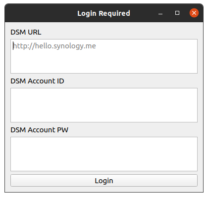

# Synology Download Station Client for PC (Windows / Linux / Mac)

</img>
</img>
</img>

Synology DSM Download Station 패키지의 PC 클라이언트입니다.
작업 추가/삭제/정지 등의 관리가 가능하며,
URL 및 토렌트 파일의 다운로드를 지원합니다.

***

### 배포 내역
* 2020\. 08\. 개발 시작
* 2020\. 08\. V1\.0 배포
* 2020\. 09\. V1\.1 배포 : Synology OTP 로그인 지원
